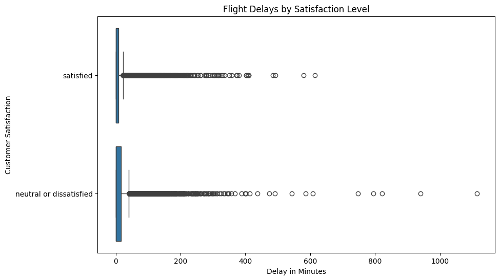

# Flight Arrival Delay & Customer Satisfaction Analysis


## 📌 Project Overview
This project analyzes the relationship between **flight arrival delays** and **customer satisfaction**. 

Unlike standard analyses that rely on simple averages (means), this project applies **Non-Parametric Statistical Testing** to account for the skewed nature of flight delay data. The goal is to rigorously determine if the difference in delay duration between "Satisfied" and "Neutral/Dissatisfied" customers is statistically significant or merely due to random chance.

## 🧪 Hypothesis
To validate the impact of punctuality on customer sentiment, I established the following hypotheses:

* **Null Hypothesis ($H_0$):** There is no significant difference in delay duration between satisfied and neutral/dissatisfied customers.
* **Alternative Hypothesis ($H_1$):** Satisfied customers experience significantly lower flight delays than neutral/dissatisfied customers.

## 🛠 Technologies Used
* **Python:** Core programming language.
* **Pandas:** Data engineering, cleaning, and manipulation.
* **Matplotlib & Seaborn:** Exploratory Data Analysis (EDA) and visualization (Boxplots).
* **Scipy.stats:** Statistical hypothesis testing (Mann-Whitney U).

## 📊 Methodology

### 1. Data Cleaning
* Handled missing values in the dataset.
* Categorized satisfaction levels into binary groups for testing.

### 2. Exploratory Data Analysis (EDA) & Assumption Checking
* **Distribution Check:** Analyzed the distribution of delay times.
* **Outlier Detection:** Generated **Boxplots** to visualize the spread of flight delays.
* **Observation:** The data was found to be **heavily skewed** (non-normal), with significant outliers particularly in the "Long Haul" category. This violation of normality invalidated the use of a standard T-Test, necessitating a non-parametric approach.

### 3. Statistical Testing
* Applied the **Mann-Whitney U Test** (`scipy.stats`) to compare the delay distributions of the two customer groups.
* This test is robust against outliers and suitable for comparing independent samples from non-normal distributions.

## 📈 Key Results

### Visual Analysis

> *The boxplot analysis revealed significant outliers in the "Long Haul" category, indicating that while the median delay is often low, extreme delays are common.*

### Statistical Findings
**Result: Statistically Significant ($p < 0.05$)**

The Mann-Whitney U test returned a p-value less than 0.05, leading to the rejection of the Null Hypothesis.

* **Conclusion:** The analysis confirms that flight delays are **genuinely and significantly lower** for satisfied customers.
* **Business Impact:** This validates that punctuality is a critical driver of positive customer sentiment, and operational improvements in arrival times will directly correlate with higher satisfaction scores.

## 💻 Code Snippet: Hypothesis Testing
Below is the core logic used to perform the statistical test in Python:

```python
from scipy.stats import mannwhitneyu

# 1. Separate the data into two groups
satisfied_delays = df[df['satisfaction'] == 'satisfied']['Arrival Delay in Minutes']
dissatisfied_delays = df[df['satisfaction'] == 'neutral or dissatisfied']['Arrival Delay in Minutes']

# 2. Run the Mann-Whitney U Test (One-tailed: satisfied < dissatisfied)
stat, p_value = mannwhitneyu(satisfied_delays, dissatisfied_delays, alternative='less')

print(f"Statistic: {stat}")
print(f"P-Value: {p_value}")

# 3. Interpret the result
if p_value < 0.05:
    print("RESULT: Statistically Significant. Delays are genuinely lower for satisfied customers.")
else:
    print("RESULT: Not Significant. The difference could be due to random chance.")
